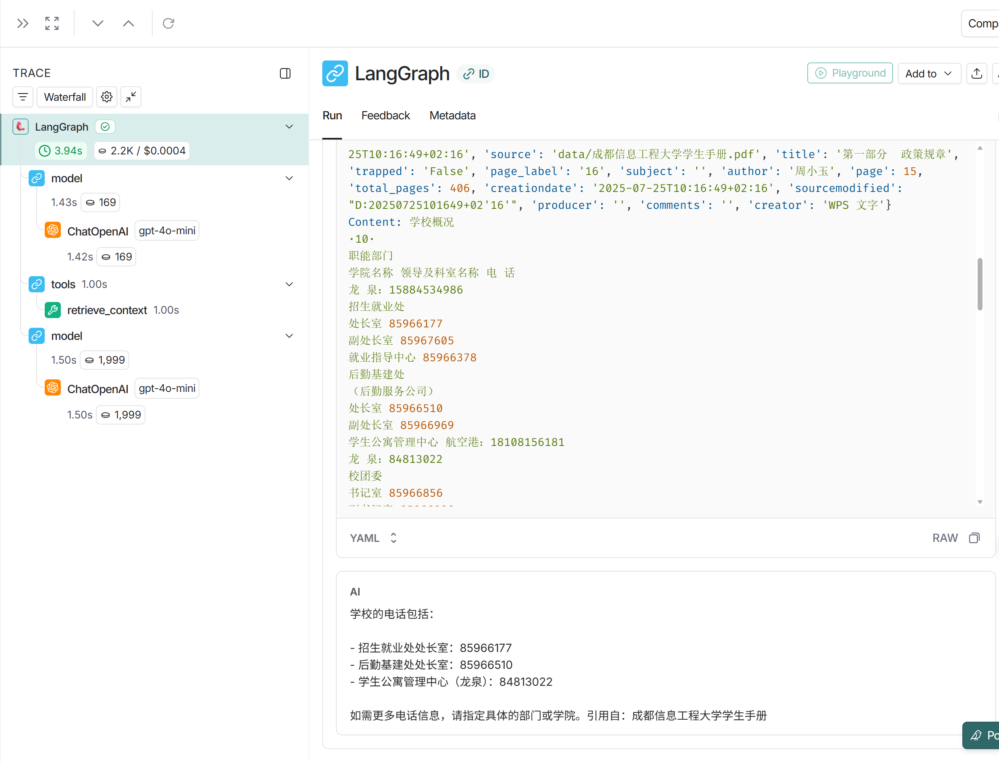
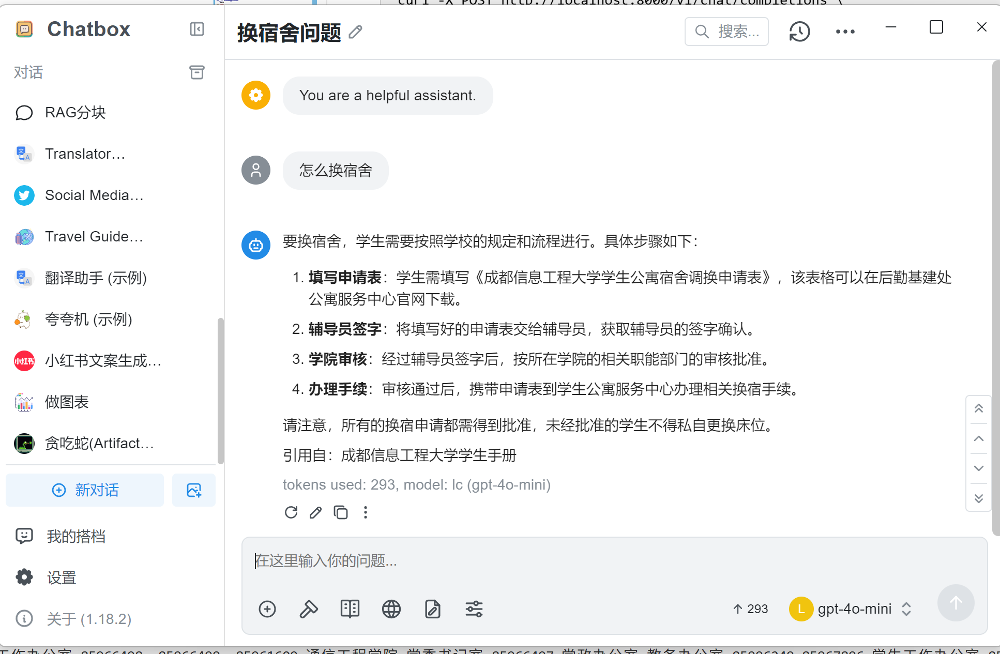

# LangChain RAG 问答系统

本项目使用 LangChain 构建了一个基于学生手册的问答系统，支持云端 OpenAI API 和本地 Ollama 两种部署方式。系统通过 Chroma 向量数据库进行语义检索，并集成了 LangSmith 进行调用链追踪。


## 功能特性

- 智能问答：基于学生手册内容的精准问答
- 文档引用：每条回答都标注文档来源，可追溯
- 向量检索：使用 Chroma 向量数据库进行语义搜索
- OpenAI 兼容：完全兼容 OpenAI Chat Completions API 格式
- 流式响应：支持流式和非流式两种输出模式
- LangSmith 追踪：集成 LangSmith 进行调用链追踪
- 双模式部署：支持云端 API 和本地 Ollama 两种部署方式

## 技术栈

- **框架**：FastAPI + LangChain
- **LLM**：OpenAI GPT-4o-mini / Ollama Qwen2.5
- **向量数据库**：Chroma
- **嵌入模型**：OpenAI text-embedding-3-large / Ollama nomic-embed-text
- **追踪**：LangSmith

## 系统架构

```
用户提问 → FastAPI 接口 → LangChain Agent
                              ↓
                        调用 retrieve_context 工具
                              ↓
                    Chroma 向量数据库语义检索
                              ↓
                         返回相关文档片段
                              ↓
                    LLM 基于文档生成答案
                              ↓
                          返回给用户
```

## 环境要求

- Python >= 3.10
- uv（推荐）或 pip

## 安装步骤

### 1. 克隆项目

```bash
git clone https://github.com/TrueTechLabs/lcrag_studentqa
cd lcrag_studentqa
```

### 2. 安装依赖

**使用 uv（推荐）：**
```bash
uv sync
```

**或使用 pip：**
```bash
pip install -e .
```

### 3. 配置环境变量

复制环境变量模板并编辑：

```bash
cp .env.example .env
```

编辑 `.env` 文件，根据你的需求选择部署模式。

## 配置说明

### 模式一：云端 API（推荐用于生产环境）
可使用[DMX API](https://www.dmxapi.cn/register?aff=dR0o7)注册并获取OpenAI兼容API Key。
```bash
# OpenAI API 配置
OPENAI_API_KEY=sk-your-api-key-here
OPENAI_API_BASE=https://api.openai.com/v1
EMBEDDING_MODEL=text-embedding-3-large
LLM_MODEL=gpt-4o-mini
VECTOR_DB_PATH=./vector_db

# 向量数据库配置
COLLECTION_NAME=student_handbook

# 检索配置
TOP_K=5
CHUNK_SIZE=1000
CHUNK_OVERLAP=200

# API 配置
API_HOST=0.0.0.0
API_PORT=8000

# LangSmith 追踪（可选）
LANGSMITH_TRACING=True
LANGSMITH_API_KEY=lsv2_your-langsmith-key
```

### 模式二：本地部署（完全离线）

首先启动 Ollama 服务：

```bash
# 安装 Ollama（如果还没安装）
curl -fsSL https://ollama.com/install.sh | sh

# 拉取模型
ollama pull nomic-embed-text  # 嵌入模型
ollama pull qwen2.5:3b        # LLM 模型

# 启动 Ollama 服务
ollama serve
```

然后配置 `.env`：

```bash
# 使用本地 Ollama
OPENAI_API_BASE=http://localhost:11434/v1
EMBEDDING_MODEL=nomic-embed-text
LLM_MODEL=qwen2.5:3b-instruct
VECTOR_DB_PATH=./vector_db_ollama

# 其他配置同上...
```

**注意**：系统会自动检测 `localhost:11434` 或 `127.0.0.1:11434` 来判断是否使用 Ollama。

## 运行方式

### 1. 数据入库（首次使用必须）

将学生手册 PDF 文档向量化并存入数据库：

```bash
python scripts/ingest.py
```

这个过程可能需要几分钟，取决于文档大小。

**测试检索效果**（可选）：

```bash
python scripts/ingest.py test
```

### 2. 启动服务

```bash
python main.py
```

服务将在 `http://0.0.0.0:8000` 启动。


## API 使用示例

### 获取可用模型列表

```bash
curl http://localhost:8000/v1/models
```

### 发送问答请求（非流式）

```bash
curl -X POST http://localhost:8000/v1/chat/completions \
  -H "Content-Type: application/json" \
  -d '{
    "model": "gpt-4o-mini",
    "messages": [
      {"role": "user", "content": "学校电话是多少？"}
    ],
    "stream": false
  }'
```
### 在LangSmith中查看调用链
1. https://smith.langchain.com/ 登录你的LangSmith账号，获取API Key并配置到.env文件中。
2. 进入 "Runs" 页面，查看调用记录。
   

### 使用Chatbox调用
1. 打开Chatbox，找到设置
2. 配置API地址为 `http://localhost:8000/v1`，API Key随意填写
3. 保存并开始聊天


### Python 调用示例

```python
import requests

response = requests.post(
    "http://localhost:8000/v1/chat/completions",
    json={
        "model": "gpt-4o-mini",
        "messages": [
            {"role": "user", "content": "奖学金申请条件是什么？"}
        ]
    }
)

answer = response.json()["choices"][0]["message"]["content"]
print(answer)
```

### 使用 OpenAI SDK

```python
from openai import OpenAI

client = OpenAI(
    base_url="http://localhost:8000/v1",
    api_key="dummy"  # 本地部署可以随意填写
)

response = client.chat.completions.create(
    model="gpt-4o-mini",
    messages=[
        {"role": "user", "content": "学校有哪些奖学金？"}
    ]
)

print(response.choices[0].message.content)
```

## 项目结构

```
lcrag_studentqa/
├── src/studentqa/
│   ├── __init__.py       # 包初始化
│   ├── config.py         # 配置管理（Pydantic Settings）
│   ├── loader.py         # PDF 加载和向量化入库
│   ├── retrieval.py      # 向量检索和 RAG 工具
│   ├── agent.py          # LangChain Agent 和提示词
│   └── api.py            # FastAPI 路由和接口
├── scripts/
│   └── ingest.py         # 数据入库脚本
├── data/                 # 存放 PDF 文档
├── vector_db/            # Chroma 向量数据库（云端模式）
├── vector_db_ollama/     # Chroma 向量数据库（本地模式）
├── main.py               # 应用启动入口
├── .env.example          # 环境变量模板
├── .env                  # 实际环境变量（不提交到 Git）
├── pyproject.toml        # 项目依赖和配置
└── README.md             # 项目说明
```


## 常见问题

### 1. 向量数据库创建失败

**问题**：首次运行时报错 `Collection not found`

**解决**：先运行 `python scripts/ingest.py` 进行数据入库

### 2. 本地 Ollama 模式无法工作

**问题**：Ollama 返回连接错误

**解决**：
- 确认 Ollama 服务已启动：`ollama serve`
- 确认模型已下载：`ollama list`
- 检查端口是否正确：`curl http://localhost:11434/v1/models`

### 3. 检索结果不准确

**调整参数**：
- 增加 `TOP_K` 值（默认 5）
- 调整 `CHUNK_SIZE` 和 `CHUNK_OVERLAP`
- 重新运行数据入库脚本

### 4. LangSmith 追踪不工作

**检查**：
- `LANGSMITH_TRACING=True`
- `LANGSMITH_API_KEY` 有效
- 网络可访问 LangSmith 服务

### 5. 内存占用过高

**解决**：
- 本地模式使用更小的模型（如 `qwen2.5:3b`）
- 减小 `CHUNK_SIZE`
- 减小 `TOP_K`

## 配置参数说明

| 参数 | 说明 | 默认值 |
|------|------|--------|
| `OPENAI_API_KEY` | OpenAI API 密钥 | - |
| `OPENAI_API_BASE` | API 基础 URL | `https://api.openai.com/v1` |
| `EMBEDDING_MODEL` | 嵌入模型 | `text-embedding-3-large` |
| `LLM_MODEL` | 大语言模型 | `gpt-4o-mini` |
| `VECTOR_DB_PATH` | 向量数据库路径 | `./vector_db` |
| `COLLECTION_NAME` | 集合名称 | `student_handbook` |
| `TOP_K` | 检索返回数量 | 5 |
| `CHUNK_SIZE` | 文档分块大小 | 1000 |
| `CHUNK_OVERLAP` | 分块重叠大小 | 200 |
| `API_HOST` | API 服务地址 | `0.0.0.0` |
| `API_PORT` | API 服务端口 | 8000 |
| `OLLAMA_HOSTS` | Ollama 主机列表 | `["localhost:11434", "127.0.0.1:11434"]` |

## 技术支持

如有问题，请提交 Issue 或联系开发团队。

## 许可证

MIT License

[](https://star-history.com/#your-username/lcrag_studentqa&Date)
